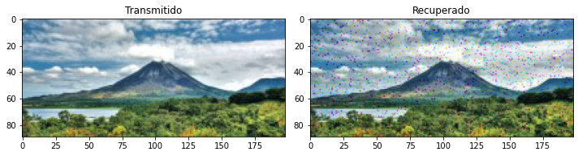

---

## Universidad de Costa Rica
### Escuela de Ingeniería Eléctrica
#### IE0405 - Modelos Probabilísticos de Señales y Sistemas

Segundo semestre del 2020

---

* Estudiante: **Jordileth Bonilla Segura**
* Carné: **B41083**
* Grupo: **02**

# `P4` - *Modulación digital IQ*

### 4.1. - Modulación QPSK

Inicialmente, se recuperan los valores de la imagen a procesar y estos valores son convertidos para ser manipulados adecuadamente.
Seguidamente, se procede a hacer la modulación; como para este tipo de modulación se define con la suma de la función coseno y la función seno, 
se debe buscar un modo de realizar esta modulación para cada una de las funciones. En este caso se optó por la más sencilla: realizar dos moduladores separados para
cada función y las resultantes se suman para obtener el modulador total. Esto mismo pasa con sus respectivas portadoras y potencias, además de la señal de interés, 
la cual también será la suma de las señales individuales por modulador. 

Posteriormente se genera la señal de ruido y la etapa de demodulación. Finalmente, se recupera la imagen. Se utiliza una frecuencia de portadora de 5000 Hz, lo cual es algo bajo
para lo que se acostumbra utilizar "en la práctica", pero funciona bien para este caso; las muestras por periodo son 40 y la relación de señal-ruido es de 0. Teóricamente,
este valor es de 5 para lograr el mejor resultado, sin embargo, se elige emplear uno distinto para apreciar mejor la recuperación de la imagen y los fallos que puede haber. 

Se obtiene lo siguiente a partir de la simulación: 

Duración de la simulación:  15.540140151977539 
8252 errores, para un BER de 0.0195.

 

### 4.2. - Estacionaridad y ergodicidad

Para la señal asignada *signal_Txx*, se obtiene que el promedio estadístico y el promedio temporal son iguales a cero, lo que indica que el proceso es ergódico y además, 
es estacionario en sentido amplio, pues el valor esperado no cambiará en el tiempo. Esto puede apreciarse y resumirse con la siguiente figura a partir de la simulación realizada. 
**Nota**: el promedio estadístico se indica en color azul marino, mientras que el promedio temporal se ilustra en color palo rosa. 

### 4.3. - Densidad espectral de potencia

De acuerdo con el código del archivo *P4.py*, la densidad espectral de potencia se aprecia en la figura siguiente. 

